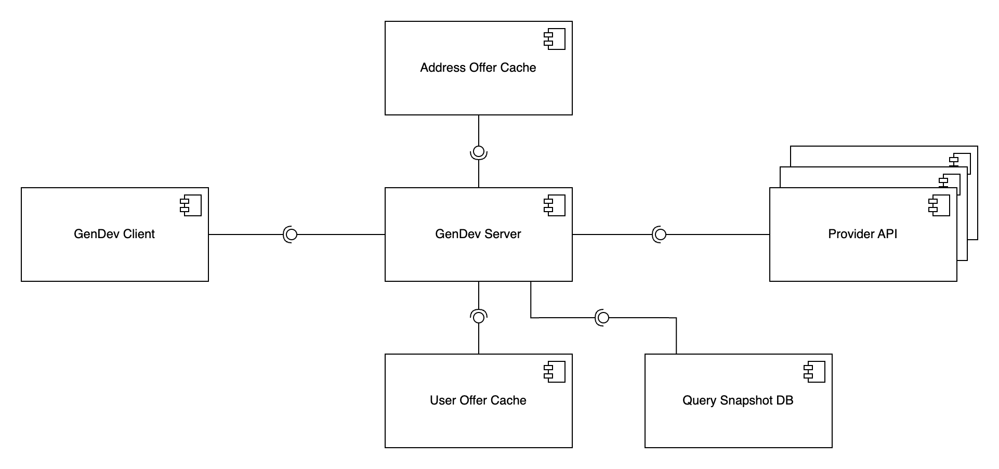
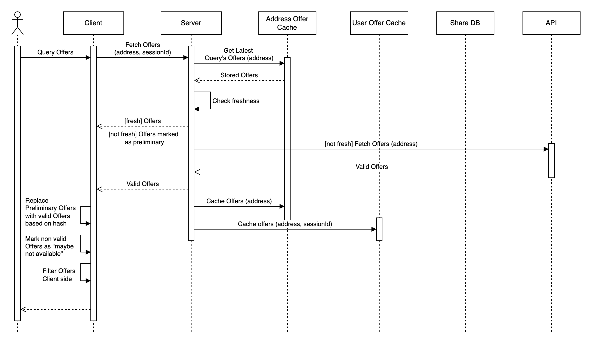
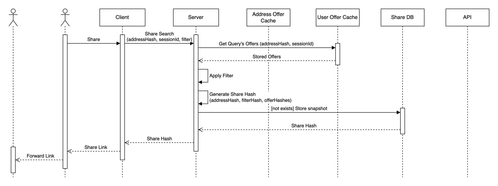
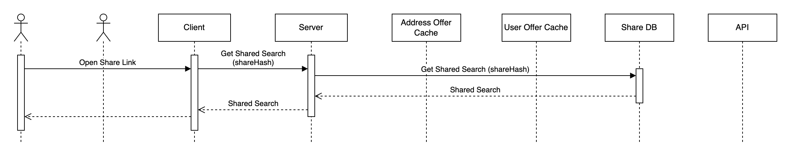
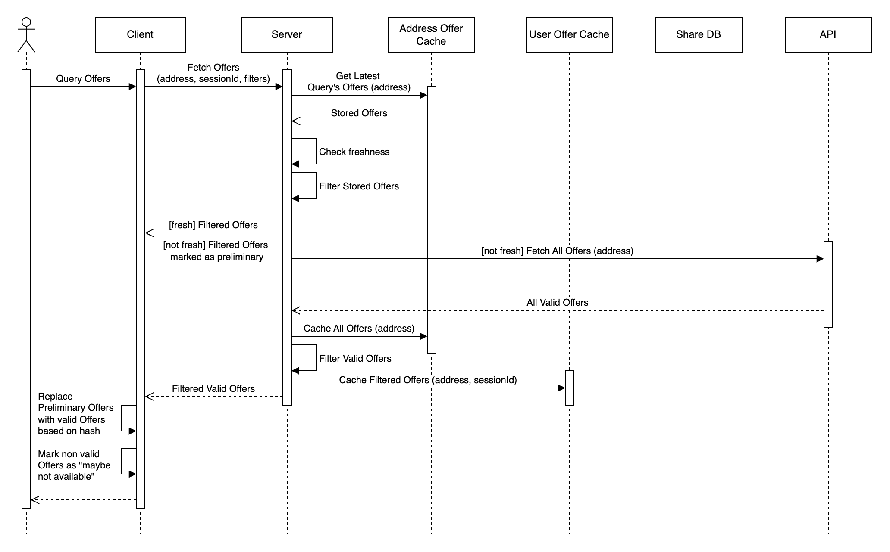

# CHECK24 GenDev Internet Provider Comparison Challenge by Dennis Jandow

This is my solution for the CHECK24 GenDev Internet Provider Comparison Challenge with **golang channels**, **caching** and more.\
The Problem Statement can be found [here](PROBLEM.md).

## Table of Contents

- [CHECK24 GenDev Internet Provider Comparison Challenge](#check24-gendev-internet-provider-comparison-challenge-by-dennis-jandow)

  - [Table of Contents](#table-of-contents)
  - [Top Level Architecture](#top-level-architecture)
    - [Address Offer Cache](#address-offer-cache)
    - [User Offer Cache](#user-offer-cache)
    - [Share Link DB](#share-link-db)
    - [Server Side](#server-side)
    - [Client Side](#client-side)
  - [Information Flow](#information-flow)
    - [Searching for Offers](#searching-for-offers)
    - [Sharing Search Results](#sharing-search-results)
    - [Accessing Share Links](#accessing-share-links)
  - [Per Provider Hacks](#per-provider-hacks)
    - [ByteMe](#byteme)
    - [Ping Perfect](#ping-perfect)
    - [Servus Speed](#servus-speed)
    - [VerbynDich](#verbyndich)
    - [WebWunder](#webwunder)
  - [Possible Improvements](#possible-improvements)
    - [Server Side Filtering](#server-side-filtering)
    - [Delta Cache](#delta-cache)
  - [Disclaimer](#disclaimer)

  ## Top Level Architecture

  The system should provide a comparison of internet offers from different providers. Each provider has its own API, which may be unreliable or slow. Therefore we must guarantee a smooth user experience even in the case of API failures or delays.\
  Furthemore users would like to share their search results. The share link should always exactly reflect what the user has seen, even if a provider is down.

  

  The architecture consists of several subsystems:

  - **GenDev Client**: The frontend application that interacts with the user and displays offers.
  - **GenDev Server**: The backend application that handles API requests, caching, and data processing.
  - **Address Offer Cache**: Caches offers per address to avoid unnecessary API calls and to provide quick access to offers for a specific address.
  - **User Offer Cache**: Caches offers per user to make searches shareable without having too many database calls.
  - **Share Link DB**: Stores shared search queries and their results, allowing users to share links that reflect snapshots of offers.

  The following chapters describes each subsystem in more detail.

  ### Address Offer Cache

  The address offer cache is a server-side cache that stores offers per address. Its main purpose is to avoid unnecessary API calls to the providers as long as the freshness of data is guaranteed and to provide early preliminary results to the user. As this cache is mostly use full for frequent searches, the time to live (TTL) of the cache should be set to a reasonable relativly low value, e.g. 5 minutes.

  ### User Offer Cache

  The user offer cache stores offers per search parameters for each user. This allows users to share their search results without having to write into a database on each search. The cache entry is then retrieved when the user actively clicks the share button. The TTL should be set to a value representing the time a user is likely to have his search results still open and wants to share them, e.g. 24 hours.

  ### Share Link DB

  The share link database stores shared search queries and their results. When a user clicks the share button, a new entry is created in the share link database with the search parameters and the corresponding offers from the user offer cache. This allows users to share links that reflect snapshots of offers, even if a provider is down.\
  For the simplicity of this implementation, the share link database is a simple mongo db collection similar to a key-value store. For proper production use, a relational database would be more suitable, as it allows search queries to have relations to same offers and therefore save memory.

  ### Server Side

  The server is a golang server that handles API requests, caching, and data processing in high parallelism. It interacts with the provider APIs to fetch offers and processes the results to provide a unified response to the client. The server also manages the address offer cache and user offer cache to ensure efficient data retrieval.

  ### Client Side

  The client is an Angular application with tailwind and spartan UI components. It provides a user interface for searching and comparing internet offers from different providers. The client interacts with the GenDev server to fetch offers and share results.

  ## Information Flow

  The following explains how the information flows through the system for certain user actions. It will also describe where and how optimizations are applied to ensure a smooth user experience.

  ### Searching for Offers

  The most important user action is searching for offers based on an address and filters. To handle this request performantly on the server the following steps are taken.

  

  1. The server receives a search request from the client with the address specified. The filters will not be send as in the request as we will do client side filtering. The reason for that will be explained later.
  2. The address cache keeps offers from previous searches with the same address. Therefore we can use this cache to provide early results to the user. Depending on the freshness of the cache (this is a threshold that can be configured) we can return only the cached offer or make an additional API call to the providers to get new fresh offers. If an additional API call is made, the cached offers are marked as preliminary, to give the user early results but still communicate that these results are not final.
  3. The user makes the API calls to the providers in parallel and writes them into a stream of results. This allows us to process the results as soon as they arrive and also forward them to the user as soon as they arrive.
  4. While streaming the results to the user, we also aggregate the results to write them into our caches. The address offer cache is updated only with fresh results to ensure fresh results for future searches with the same address. The user offer cache will be later used to allow sharing of snapshots. Therefore it has to hold all offers, preliminary and fresh ones. If a preliminary offer has an equivalent fresh offer, only the fresh offer will be written to the user offer cache as the client will alos only display the fresh offer to the user.
  5. The client receives the results asychronously and displays them to the user as soon as they arrive. If a fresh offer arrives which has an preliminary equivalent, the client will replace the preliminary offer with the fresh one.
  6. The client will apply client side filtering to reduce the number of api calls made to the server and to reduce waiting times for the user when applying filters.\
     [Possible Improvements](#server-side-filtering) will explain an alternative approach with server side filtering.

  ### Sharing Search Results

  Search results can be shared with other users. This can be done either by **sharing the URL** of the current page or by **clicking the explicit share button**.\
  When sharing only the URL, the current search parameters are shared which will trigger a new search on the server when the link is opened.\
  When clicking the share button, a snapshot of the current search will be created and the exact search results can be seen with the generated link.\
  In the following we will only explain the explicit share button, as the URL sharing is straightforward.

  

  1. The user clicks the share button in the client. This will send a request to the server with the addressHash, sessionId and the current filters applied.
  2. The server will look up the user offer cache based on the addressHash and sessionId. If no entry is found, the server will return an error to the client indicating that the search is too old for sharing.
  3. The found entry will contain all offers for the given address from the time of the search. These offers will not be filtered yet (as we've done client side filtering), so the server will apply the filters before storing the snapshot.
  4. The server will create a new entry in the share link database. The id for the entry will be based on the addressHash, filterParams and offer hashes. This ensures that regenerating the share link will always yield the same result and existing share links can be reused.
  5. The server will return the share link to the client which can then be forwarded to other users.

  ### Accessing Share Links

  Accessing a share link is as simple as opening the link in the browser, which will then trigger a request to the server to look up the snapshot entry based on the share link id. \
  \
  This approach could be combined with triggering a new search request based on the address and then validating which of the shared offers are still valid. But as an exact snapshot was required, this UX optimimization was not implemented.

  

  ## Per Provider Hacks

  The following section will explain improvements made per provider to ensure a smooth and fast user experience.\
  All provider requests are made in a parallel matter with each request wrapped in a **jittered retry mechanism** to ensure fast results but also to handle API failures gracefully.\
  A further improvement which was not implement is to use a **circuit breaker pattern** to avoid making requests to providers that are known to be down. But as offers a streamed asynchroniously to the client, waiting for the retry mechanism to finish does not influence the user experience too much.

  ### ByteMe

  The main challenge with the ByteMe provider is that offers might be sent out multiple times. This can lead to duplicate offers in the results and more data send to the client than necessary.\
  This challenge was not solved directly but is handled by our **hash set** implementation which handles offers based on their hash and their validity.

  ### Ping Perfect

  The Ping Perfect provider has the option to filter offers based on if the user wants fiber or not.\
  As we will save all offers in our caches regardless of filters, we can just request offers with the `wantFiber`parameter set to `false` as this will return all offers including fiber offers.

  ### Sevus Speed

  The Servus Speed provider does not only provide one singular endpoint returning all offers based on address but rather two endpoints:

  - `/api/external/available-products`: Returns a list of available products based on address.
  - `/api/external/product-details/{productId}`: Returns the details of a specific product based on its id.

  To get all offers for a given address, we first have to call the `/api/external/available-products` endpoint to get a list of available products. Afterwards we can call the `/api/external/product-details/{productId}` endpoint for each product in parallel. Our **jittered retry mechanism** will ensure that we do not overload the API with requests and that we handle failures gracefully.

  ### VerbynDich

  The VerbynDich provider provides a pagination based API which returns one offer per page.\
  The API does return a `last` boolean `true` for the last offer. Therefore the naive approach would be to call the endpoint until we receive an offer with `last` set to `true`. This would mean that we would make one request at a time and wait for the response before making the next request.\
  Luckly all pages exceeding the last page return a `last = true` and `valid = false`. This enables use to not make a single request at a time but rather make batch request for multiple pages at once. If then any of the workers receive a `last = true` we can stop all further requests. Here again our **jittered retry mechanism** will ensure that we do not overload the API with requests and that we handle failures gracefully.\
  \
  A further challenge of the VerbynDich API was that the returned offers are not in a json format but rather in a simple string format. This string can be read with a **regualar expression** to extract the necessary information. I was not able to define multiple optional caputure groups after each other, therefore I had to use more then one regex to extract the necessary information.

  ### WebWunder

  The WebWunder provider has a SOAP based API. This was not straightforward to implement, but was achieved by using simple XML encoding. Similar to Ping Perfect API, the WebWunder API allowed to filter offers in the request. As we will save the offers regardless of filters in the cache and filter client side, we wanted to request all offers.\
  The WebWunder API supported filtering by `installation` and `connectionType`. To get all offers, we requested a crossproduct of all possible parameters in parallel and combined their results. Same offers were returned for `installation = true` and `installation = false`. As it was unclear if they are the same offers or same conditions but different offers, we decided to keep both.

  ## Possible Improvements

  ### Server Side Filtering

  As mentioned above the current implementation does client side filtering. This means that the server returns all offers for a given address and the client filters them based on the applied filters. This has the advantage that the server does not have to handle additional API calls to filter offers and because of the client workflow it fetches all offers unfiltered on the initial request either way.\
  The disadvantage is that the client has to process all offers and filter them, which can lead to a slower user experience if there are many offers.\
  To highlight both approaches, I will describe an alternative approach with server side filtering.

  

  - The address offer cache will still be used to cache all offer available for the given address regardless of filters.
  - The early results will now be filtered by the server before returning them to the client.
  - The request to the providers will still retrieve all offers regardless of filters, so that fresh cached results can be shared between users regardless of their filters.
  - The user offer cache will now only store offers that match the filter. This would also allow to make server side pagination possible as we know the total number of offers matching the filter.
  - To share search results, the server will not have to apply filters again, but can just save the user offer cache entry as a snapshot into the share link database.

  This approach was not used in th current implementation because each filter change would require a new API call to the server and in the current client workflow, coming from the home page the user is only able to search based on address and has then all offers client side.\
  This problem could be bypassed by only returning a first page of results on the initial request. All further filtering request would then use the address offer cache to filter fresh offers without having to make too many api request to the providers and providing the user with fast responses.

  ### Delta Cache

  As the providers most likely will not change their offers too often, a delta cache could be used to store changes between searches. This would allow us to merge the two caches into one with **reduced memory usage**. This section will explain how this could be implemented.\
  \
  A delta storage is a storage that only stores changes to the previous entry. This means instead of storing all offers for an address per timestamp, we only store the changes that happened since the last search (possible providers being down or offers being added or removed). This would then allow us to efficiently retrieve a search from a certain timestamp by merging all deltas from the base storage entry.\
  The user offer cache would then just be an entry with a certain timestamp which can then be forwarded to the share link database on share link generation. This again would require client side filtering, as filtered searches would have to much delta difference.\
  To transform a delta storage to a cache we would need to merge the oldest entries on TTL expiration. If the TTL is relatively low, this would mean a lot of merge operations, which could impact the CPU performance.\
  Furthermore generating a share link would take longer, as the deltas from the base entry up until the timestamp of the share would have to be merged. This could impact the user experience but might be acceptable in regards to the memory usage.

  ## Disclaimer

  In this description I sometimes used the term `"we"`, this is just a habit of working in teams normally and to make the text more readable. It should not imply that I worked with anyone else on this project.
